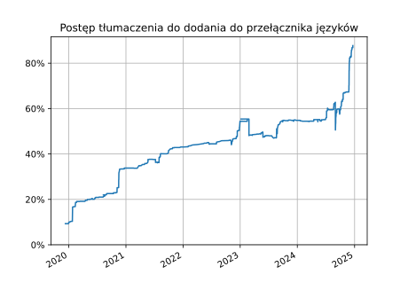

Polish Translation of Python Documentation
========================================
<!-- [[[cog
from manage_translation import get_resource_language_stats, progress_from_resources, language_switcher, get_number_of_translators

stats = get_resource_language_stats()
switcher = progress_from_resources(filter(language_switcher, stats))
total = progress_from_resources(stats)
translators = get_number_of_translators()

print(
f'''

''')
]]] -->

<!-- [[[end]]] -->

*Przeczytaj to w innym języku: [Polski](README.md)*

If you find a mistake or have a suggestion,
[let us know](https://github.com/python/python-docs-pl/issues) or fix it yourself:

* Go to the website of the project [Python Documentation](https://explore.transifex.com/python-doc/python-newest/).
* Click the button "Join this project", to join the Project.
* Create an account on Transifex.
* On the project website pick the language Polish.
* After joining the Project, pick the category you want to fix/translate.

You can find more information about using Transifex
[in their help guide.](https://help.transifex.com/en/articles/6318216-translating-with-the-web-editor).

**Translation Progress**

The Polish language will appear in the language switcher in docs.python.org,
[when these categories will be fully translated](https://www.python.org/dev/peps/pep-0545/#add-translation-to-the-language-switcher):
* `bugs`,
* Everything in the `tutorial` section,
* `library/functions`.

**How to see the newest build of the documentation?**

Download the latest build from the list of artefacts in the latest GitHub Action (Actions Tab).
Translations are pulled from Transifex around every half hour.
The documentation at https://docs.python.org/pl/ is updated around once daily.

**Communication Channels**

* [Discord Python Polska #dokumentacja](https://discord.gg/QB3h2Sxc)
* [Python Documentation Community](https://docs-community.readthedocs.io/en/latest/)
* [Python Translations Working Group](https://mail.python.org/mailman3/lists/translation.python.org/)
* [Python Documentation Special Interest Group](https://www.python.org/community/sigs/current/doc-sig/)

**License**

By inviting you to work on a project on the Transifex platform, we offer a contract for
donating your translations to the Python Software Foundation
[under the CC0 license](https://creativecommons.org/publicdomain/zero/1.0/deed.pl).
In return, it will be visible that you are the translator of the part you translated.
You signify your acceptance of this agreement by submitting your work for inclusion in the documentation.

**Updating Translations**
* `./manage_translation.py recreate_tx_config`
* `./manage_translation.py fetch`
* `cog -rP README.md`

**Useful Materials**
* [Site Statistics](https://plausible.io/docs.python.org/?filters=%28%28contains,page,%28/pl/%29%29%29)
* [Python Developer's Guide: Documentation](https://devguide.python.org/documentation/)

**Similar Translation Projects**
* [Projects of the Python Packaging Authority](https://hosted.weblate.org/projects/pypa/-/pl/)
* [Scientific Python Translations](https://scientific-python-translations.github.io/)
* [Localizing Django](https://docs.djangoproject.com/en/dev/internals/contributing/localizing/)
